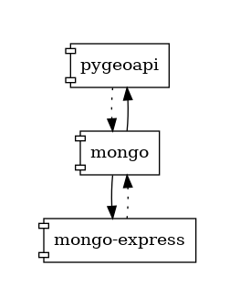

# WORKSHOP - Share your data with OGC API Features :open_hands:
This workshop shows how to share vector data, using [OGC API Features](https://ogcapi.ogc.org/dev/features), [pygeoapi](https://pygeoapi.io/) and [mongoDB](https://www.mongodb.com/).



## Prepare the dataset
We will share a [GeoJSON](./mongo_data/shops-orig.geojson) file. MongoDB imports the aray of features, without the outer "Feature" element. To extract the array, you can use the [jq](https://stedolan.github.io/jq/) command line JSON processor.

```
jq --compact-output ".features" shops-orig.geojson > shops.geojson
```

## Start the services
Run docker-compose in the background with:

```
docker-compose up -d
```

## Access the Services

* Mongo-express: http://localhost:8081/
* Pygeoapi: http://localhost:5000/

## Explore the APIs

* Swagger: http://localhost:5000/openapi?f=html
* Postman: https://www.postman.com/martian-station-561283/workspace/geospatial-api-code-sprint/collection/10287135-a53522cc-2c86-4b15-851c-589f43a0006e?action=share&creator=10287135
* QGIS: https://docs.qgis.org/3.22/en/docs/user_manual/working_with_ogc/ogc_client_support.html#wfs-and-wfs-t-client

